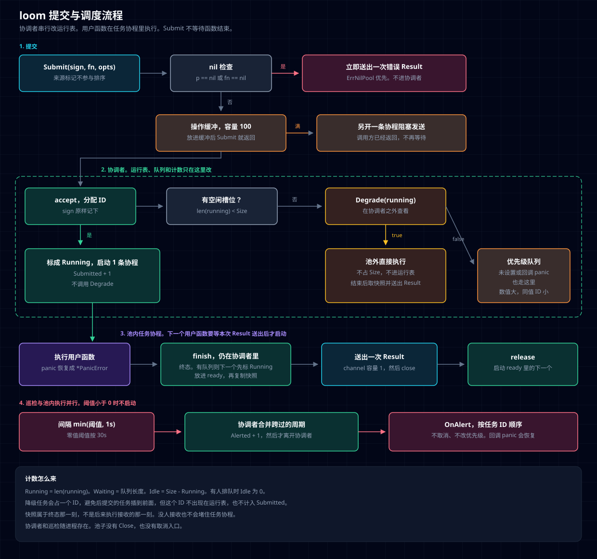

# loom

固定容量的 Go 协程池。`Submit` 立刻返回结果 channel，池满时按优先级排队。也可以用 `Degrade` 查看正在运行的任务，并决定把这次提交降级到池外直接执行。任务占用超时只告警。调度只发生在协调者协程里，池内没有互斥锁。

要求 Go 1.27 或更新。模块路径是 `github.com/cuteLittleDevil/loom` 。

## 流程



图分四段：

1. `Submit` 做 nil 检查。通过后把接受操作放进容量 100 的缓冲，然后立刻返回 channel。缓冲满了才另开一条协程去发送。
2. 协调者串行分配 ID。有空闲槽位就标成 `Running` 并启动一条任务协程。没有空位时，若设置了 `Degrade`，把当前运行任务交给它判断；返回 true 就在池外直接执行，否则进入优先级队列。
3. 池内任务执行完后回到协调者记终态、复制快照，再送出一次 `Result`。下一个用户函数要等这次结果送出后才启动。
4. 告警阈值大于等于 0 时，巡检与任务并行。它只通知，不取消任务，也不改优先级。

不变量和取舍见 [docs/design/pool.md](docs/design/pool.md) 。

## 例子

在仓库根目录执行：

```bash
go run ./example/basic
go run ./example/priority
go run ./example/degrade
go run ./example/alert
```

| 目录 | 演示 |
| --- | --- |
| `example/basic` | 提交一次任务并读取 `Result` |
| `example/priority` | `Size` 为 1 时，优先级 1、10、5 的开始顺序是 10、5、1 |
| `example/degrade` | 唯一槽位被占住时，`Degrade` 返回 true，后来的任务在池外执行 |
| `example/alert` | 任务运行超过 40ms 后打印一次 `OnAlert` |

## 使用

```go
package main

import (
	"log/slog"
	"os"
	"time"

	"github.com/cuteLittleDevil/loom"
)

// Result 是业务自己的结构体。Submit 的类型参数 R 由函数返回值推断，调用方不用写出 [R]。
type Result struct {
	Name string
}

func main() {
	// Size 是同时执行的用户函数上限，必须大于 0。
	// OccupyThreshold 大于等于 0 才启动巡检。任务还在跑且超过 30s 时调用 OnAlert，回调在协调者之外。
	// 8 个槽位都忙，并且每个任务都已运行至少 30s 时，Degrade 返回 true，这次提交改到池外执行，不占 Size。
	p, err := loom.New(loom.Config{
		Size:            8,
		OccupyThreshold: 30 * time.Second,
		OnAlert: func(a loom.Alert) {
			slog.Info("occupy", "sign", a.Sign, "id", a.TaskID, "running", a.RunningFor, "waiting", a.Waiting)
		},
		Degrade: func(running []loom.TaskInfo) bool {
			if len(running) < 8 {
				return false
			}
			for _, task := range running {
				if task.RunningFor < 30*time.Second {
					return false
				}
			}
			return true
		},
	})
	if err != nil {
		slog.Error("create pool", "err", err)
		os.Exit(1)
	}

	// sign 是来源标记，不参与优先级和任务 ID 排序。WithPriority 数值更大的先执行。
	// Submit 立刻返回容量为 1 的 channel，不等待函数结束。
	ch := p.Submit("sign", func() (Result, error) {
		return Result{Name: "ok"}, nil
	}, loom.WithPriority(10))
	// got 的类型是 loom.Result[Result]。Value 是上面的业务结构体，Snapshot 是终态那一刻的池子。
	got := <-ch
	if got.Err != nil {
		slog.Error("task", "err", got.Err)
		os.Exit(1)
	}
	slog.Info("result", "name", got.Value.Name)
}
```

`got` 的类型是 `loom.Result[Result]`。`got.Value` 是上面的结构体，`got.Snapshot` 是这次任务终态那一刻的池子。

`Size` 必须大于 0，否则 `New` 返回 `ErrInvalidSize`，并且不启动协程。

## 提交

```go
func (p *Pool) Submit[R any](sign string, fn func() (R, error), opts ...Option) <-chan loom.Result[R]
```

`sign` 是来源标记，原样出现在 `TaskInfo.Sign` 和 `Alert.Sign` 上，不参与优先级和任务 ID 排序。空字符串允许。

`fn` 的返回值决定 `R`。调用方通常不用写出 `[R]`。未传 `WithPriority` 时优先级是 0，数值更大的先执行，相同数值按任务 ID 从小到大。多个 `WithPriority` 同时出现时，最后一个生效。`opts` 里的 nil 项忽略。

返回的 channel 容量是 1。终态后送出一次 `loom.Result[R]` 并关闭。没人接收也不会堵住任务协程。第二次接收得到零值和 `ok == false`。

`p == nil` 得到 `ErrNilPool`，`fn == nil` 得到 `ErrNilFunc`。两者都为 nil 时是 `ErrNilPool`。这两种结果在 `Submit` 返回前就已经放进 channel，不进入协调者，也不改变计数。

用户函数 panic 时，任务协程恢复现场。`Result.Err` 是 `*PanicError`，`errors.Is(err, ErrPanic)` 为真，`errors.As` 可以取出 panic 的原始值和栈。

## 池满与降级

有空闲槽位时，任务直接执行，不调用 `Degrade`。

槽位都在忙时：

- `Degrade` 为 nil，或返回 false：任务进入优先级队列。`Submit` 仍然立刻返回。已经在跑的任务不会被新任务换下来。
- 返回 true：另开协程直接执行这次用户函数。它不占 `Size`，不出现在运行表里，不计入 `Submitted`。`Result` 仍从原来的 channel 送出，快照是执行结束时池子的实况。
- 回调 panic：这次任务改为入队。

`Degrade` 在协调者之外执行。不要在 `Degrade` 或用户函数里同步接收本池的 channel。外层任务占着槽位时，后面的任务排不上，这次等待不会结束。

## 告警

`OccupyThreshold` 是单次任务的占用告警线。

| 取值 | 行为 |
| --- | --- |
| 0 | 按 30s |
| 大于 0 | 用这个值，即使小于 1s |
| 小于 0 | 不启动巡检，不告警 |

巡检间隔是 `min(阈值, 1s)`。任务仍在运行且跨过一个或多个周期时，只发一次告警，`Alerted` 加 1。`OnAlert` 为 nil 时仍然计数，只是没有回调。回调在协调者之外按任务 ID 顺序执行，panic 会被恢复，巡检继续。

告警不取消任务，也不调整优先级。任务在下一次巡检看到它之前就结束的，不会补发。

## 快照

`Result.Snapshot` 描述终态那一刻，不是后来执行 `<-ch` 的那一刻。

- `Running` 是运行表长度，`Waiting` 是优先级队列长度，`Idle` 是 `Size - Running`。
- 有人排队时 `Idle` 为 0。
- `Running + Waiting == Submitted - Completed`。
- `RunningTasks` 只含已标成 `Running`、尚未终态的任务，按 ID 从小到大。
- `WaitingBy` 按优先级从高到低。

`WaitingFor` 在标成 `Running` 时冻结。`RunningFor` 在采集快照或决定告警时计算。

## 不做的事

- 没有 `Close`。协调者和巡检随进程存在。
- 没有取消入口。队列不封顶，已接受的任务会执行到函数返回或 panic。
- 不能把正在运行的函数从外面停掉。10 个任务一直不返回，后面的池内任务就一直等。要绕开这个上限，用 `Degrade` 返回 true。
- `Submit` 不能用来实现接口。Go 1.27 允许具体方法声明类型参数，接口方法仍然不行。
