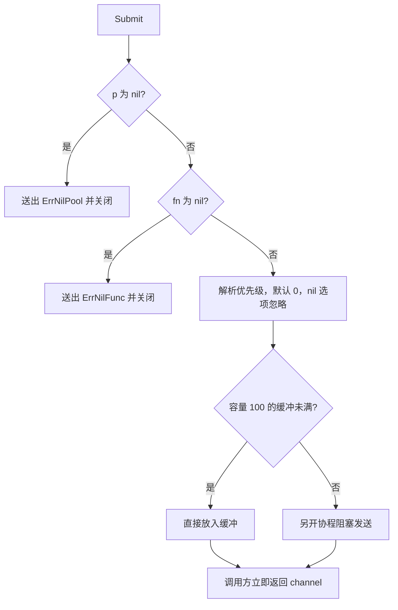
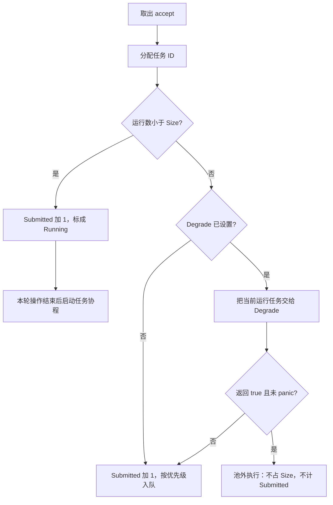
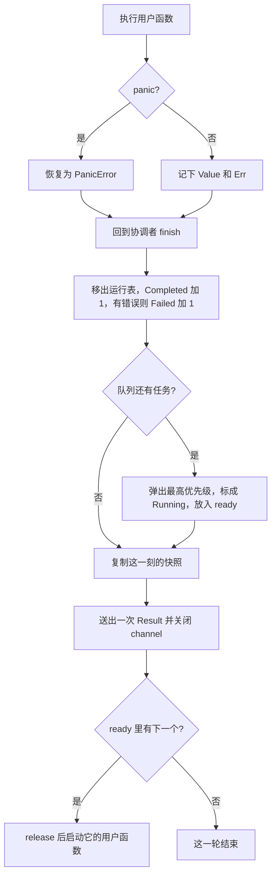
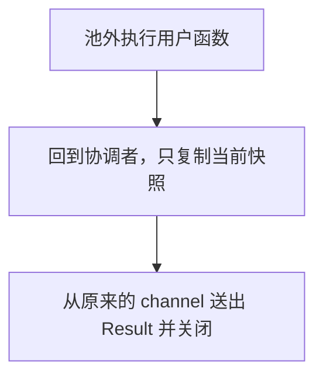
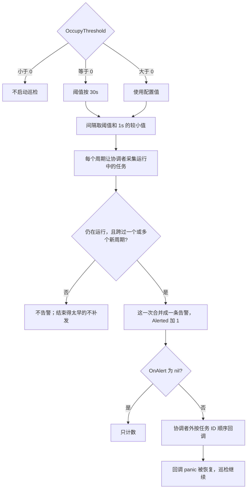

# 流程详情

总图在 [README.md](../README.md#流程) 。

## Submit

`Submit` 只做检查和投递。nil 结果在返回前就已经放进 channel，不进协调者。

## 协调者

协调者每次只处理一个接受操作。任务 ID 在这里分配。降级成功不计 `Submitted`，也不进入运行表。

## 池内终态

池内任务结束后，先记终态并送出 `Result`，然后才启动下一个用户函数。

## 池外执行

池外任务不经过槽位交接。它只复制结束时的快照，再从原来的 channel 送出。

## 巡检

巡检与任务并行。任务仍在运行，并且跨过新的占用周期时，才通知一次。

